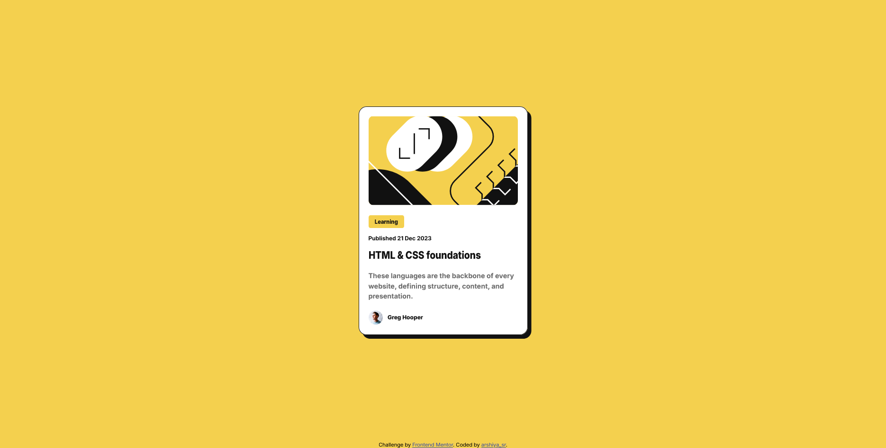

# Frontend Mentor - Blog preview card solution

This is a solution to the [Blog preview card challenge on Frontend Mentor](https://www.frontendmentor.io/challenges/blog-preview-card-ckPaj01IcS). Frontend Mentor challenges help you improve your coding skills by building realistic projects.

## Table of contents

- [Overview](#overview)
  - [The challenge](#the-challenge)
  - [Screenshot](#screenshot)
  - [Links](#links)
- [My process](#my-process)
  - [Built with](#built-with)
  - [What I learned](#what-i-learned)
  - [Continued development](#continued-development)
  - [Useful resources](#useful-resources)
  - [AI Collaboration](#ai-collaboration)
- [Author](#author)
- [Acknowledgments](#acknowledgments)

## Overview

### The challenge

Users should be able to:

- See hover and focus states for all interactive elements on the page

### Screenshot

### Links

- Solution URL: [Add solution URL here](https://github.com/arshiya-sr/frontend-mentor-Blog-preview-card-Project)
- Live Site URL: [Add live site URL here](https://arshiya-sr.github.io/frontend-mentor-Blog-preview-card-Project/)

## My process

first i completed the html structure as much as needed then i went to css and styling it after that improvements to the semantic html and better and more accurate styling.

### Built with

- Semantic HTML5 markup
- CSS custom properties
- Flexbox

### What I learned

Through this project, I learned how to style better, work faster and more efficiently, and, of course, bring the project closer to what it's truly meant to be—while making better use of the knowledge I have.

### Continued development

there is no area that needs work in this project, i think i've done it good enough, but i'll always hear your helpful recommendations.

### Useful resources

- (https://www.deepseek.com) - deepseek has helped me alot in my journey and its better to use it for actually learning things instead of cheating and passing projects.
- (https://github.com/copilot) - this AI also helped me alot, even more than deepseek, its perfect for coding, always make you think you are stupid with how good it write professional codes.
- (https://www.freecodecamp.org) - i learned my little knowledge about web developing in FreeCodeCamp, it is free and you can spend your time learning from there too, it has theory, lab, workshop and even quiz and review projects to help you learn the most of everything.

### AI Collaboration

- What tools did you use (e.g., ChatGPT, Claude, GitHub Copilot)? i only used deepseek and github copilot AI
- How did you use them (e.g., debugging, generating boilerplate, brainstorming solutions)? i used it to help me understand the structure and debug small pieces of codes.

## Author

- Website - (https://github.com/arshiya-sr)
- Frontend Mentor - (https://www.frontendmentor.io/profile/arshiya-sr)

## Acknowledgments

thank to frontend mentor for this awesome Project/Challenge, and thank to you for paying your time and attention to my project. i'd be happy to see your advice and recommendations.
hope you a good day ♥.
